[..](../skps.md)

# SKPS - Laboratorium numer 1. Bartosz Nowak, Paweł Wysocki

## 1. Przygotowanie stanowiska

Ćwiczenie laboratoryjne rozpoczynamy od przygotowania stanowiska pracy.

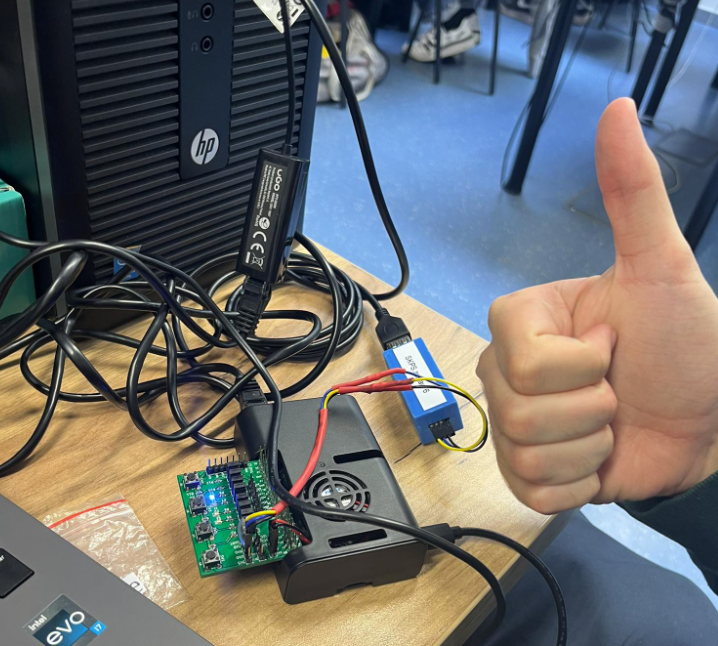

## 2. Pierwsze uruchomienie RPi

Rozpoczynamy od podłączenia się do terminala UART za pomocą ``tio``

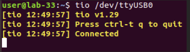

Połączenie powodzi się. Mamy teraz dostęp do terminala RPi

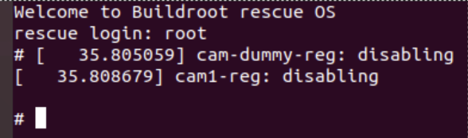

Logujemy się jako ``root``.

Następnie ręcznie uruchamiamy DHCP i czekamy na przydział adresu ip

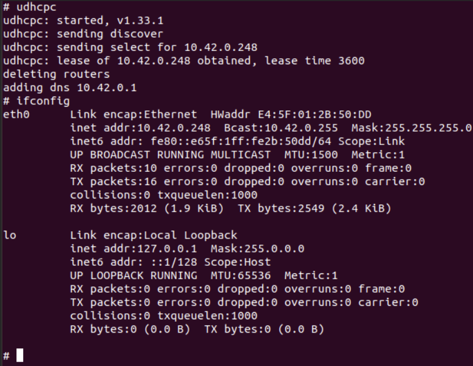

Z terminala RPi sprawdzamy, czy połączenie zostało nawiązane

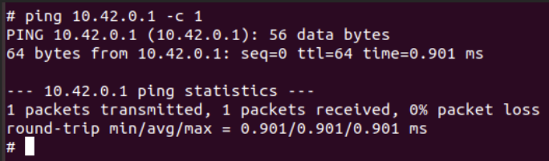

Następnie robimy to samo po stronie hosta

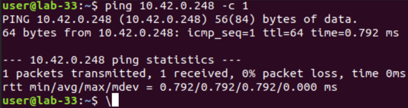

Jak widać pakiety zostają poprawnie odebrane

## 3. Przesyłanie plików przez http

Rozpoczynamy od uruchomienia serwera http na komputerze hosta za pomocą ``python -m http.server``

Na potrzeby tego ćwiczenia przygotowaliśmy testowy plik ``test.txt``, który zostanie pobrany z komputera hosta na RPi.

Za pomocą ``wget`` pobieramy plik, podając ``http://10.42.0.1:8000/test.txt``

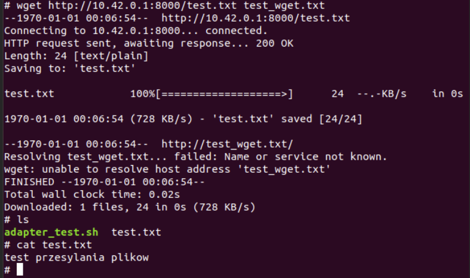

Jak widać plik został poprawnie pobrany.

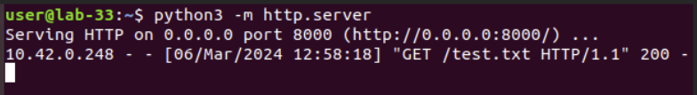

## 4. Budowanie obrazu linuxa w buildroot

Rozpoczynamy od obrazu z ``initramfs`` (ramdyskiem startowym). Aby utworzyc taką konfigurację, wchodzimy w menu konfiguracji za pomocą ``make menuconfig`` i w zakładce ``filesystem images`` ustawiamy poniższe flagi:

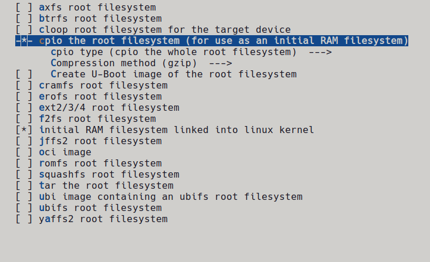

Wybieramy również dwa edytory tekstowe: ``vim`` oraz ``nano``

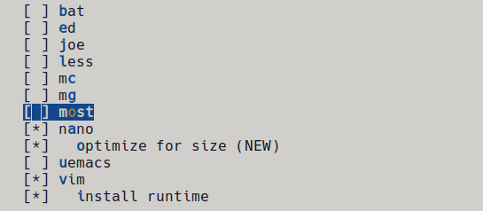

Rozpoczynamy kompilację za pomocą ``make``

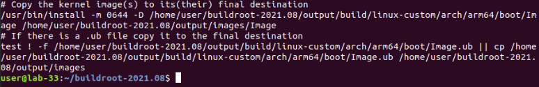

Po około pół godziny, kompilacja powiodła się.
Wymagane również było zwiększenie rozmiaru partycji ``boot`` do 128 MB w pliku
``<buildroot>/board/raspberrypi4-64/genimage-raspberrypi4-64.cfg``

## 5. Uruchomienie zbudowanego obrazu

Pobieramy zbudowany obraz z maszyny hosta za pomocą ``wget``

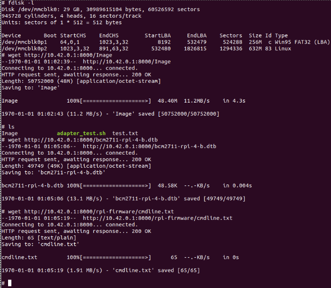

Montujemy partycję 1 (boot) karty SD w katalogu /mnt za pomocą polecenia ``mount /dev/mmcblk0p1 /mnt``

Następnie kompiujemy pobrane pliki na kartę SD i zmieniamy nazwę pliku Image na ``kernel8.img``

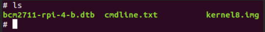

Restartujemy system i widzimy, że został zbudowany i uruchomiony poprawnie

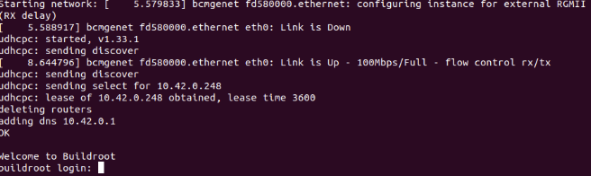

## 6. Test działania ramdysku startowego.

Sprawdzimy czy ramdysk startowy działa poprawnie. Stworzymy plik ``test.txt`` a następnie zrestartujemy system za pomocą ``reboot``, aby sprwadzić, czy plik został zapisany (spodziewamy się braku zapisu)

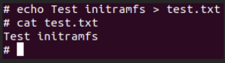

Po restarcie systemu widzimy, że plik nie został zapisany

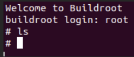

## 7. Budowanie obrazu bez initramfs

Ropoczynamy od wyczyszczenia obrazu (po skopiowaniu pliku .config)

``make linux-dirclean``

Następnie wyłączamy ramdysk startowy i włączamy system plików ``ext2``

Konfiguracja w ``make menuconfig`` w zakładce ``Filesystem images`` wygląda następująco:

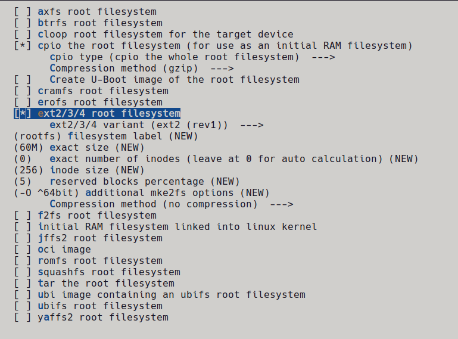

Następnie budujemy obraz za pomocą ``make``

Po zbudowaniu obrazu ponownie kopiujemy go na RPi za pomocą ``wget``

Następnie nagrywamy system plików z poziomu systemu ratunkowego na partycję ``rootfs`` karty SD.

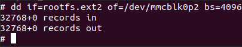

Ponownie montujemy partycję 1 karty SD i przeniosimy tam wymagane pliki

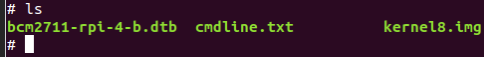

Restartjemy system i zauważamy, że uruchomienie powiodło się

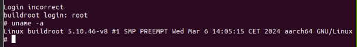

## 7. Test działania obrazu z systemem plików ext2

Tworzymy plik ``test.txt`` i restartujemy system

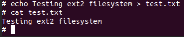

Po restarcie systemu widzimy, że plik się zachował. To oznacza, że system używa systemu plików ``ext2``, a po restarcie zapisane pliki nie są usuwane
